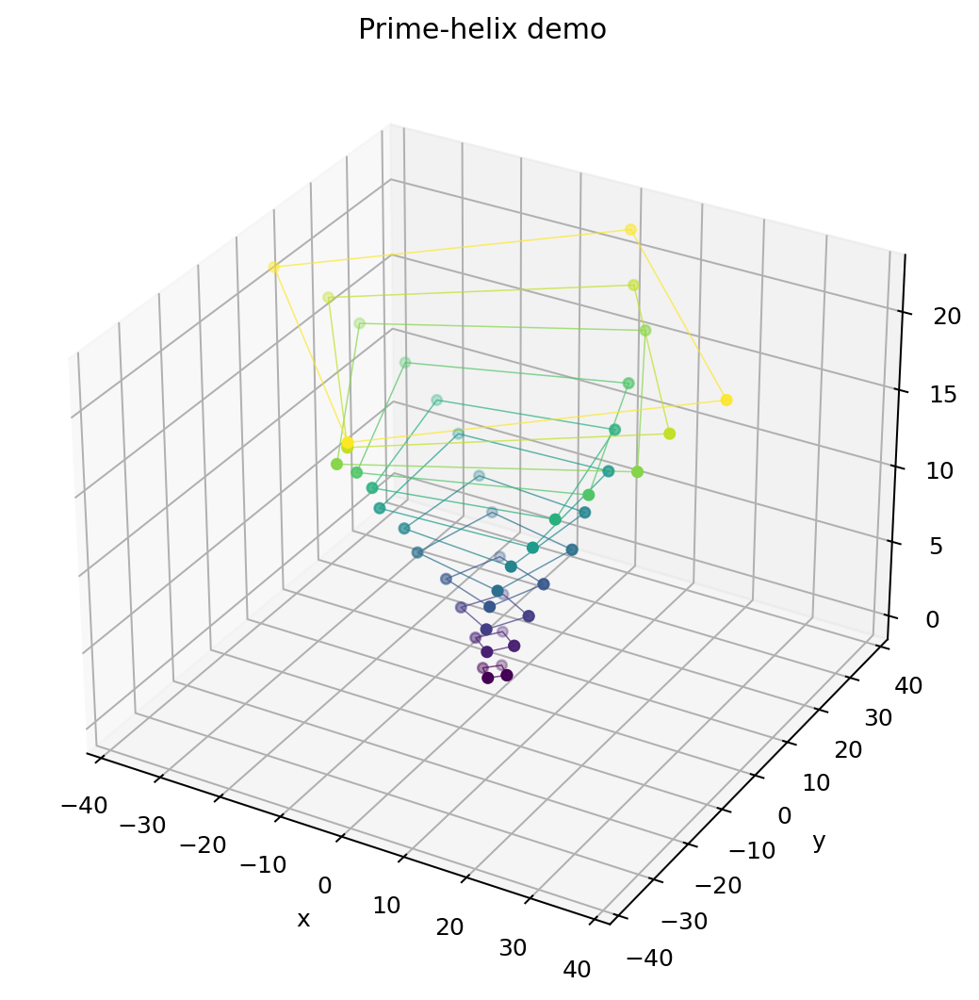

# Tetrakis-Sim: Discrete Geometry & Wave Physics

**Author:** Mike Lawrenchuk
**Project:** [tetrakis-sim](https://github.com/MikeLawrenchuk/tetrakis-sim)

---

## Overview

*Tetrakis-Sim* is a research-grade Python toolkit for discrete geometry, wave simulation, and spectral analysis on 2D/3D tetrakis-square lattices with advanced
defects (black holes, wedges, event horizons, naked singularities).

**Features:**

* Modular 2D/3D lattice and defect construction
* Physics engine: wave propagation (FDTD) on arbitrary graphs
* Black hole/event horizon, wedge, and singularity defect modeling
* Batch CLI for automated parameter sweeps
* FFT, frequency mapping, mean spectrum, and advanced visualization
* Professional workflow: Docker, reproducibility, batch logs, metadata
* Interactive analysis notebooks and publication-ready plots

---

## Prime-Helix Demo 🌐

*Tetrakis-Sim* includes a generator that winds the prime numbers into a 3-D helix of taxicab “diamond” rings. A single helper call draws the graph:

```python
from tetrakis_sim import add_prime_helix, plot_3d_graph
import networkx as nx

G = nx.Graph()
add_prime_helix(G, n_rings=12, dtheta=0.14, pitch=2.0)  # 12 prime rings
plot_3d_graph(G, node_size=16, title="Prime-helix (12 rings)")
```

<p align="center">
  
</p>

---

## Quick Start

### 1. Install (editable/dev mode for notebooks + CLI)

From the repo root:

```bash
# Recommended: dev tooling + plotting backends
python -m pip install -e ".[dev,plot]"
```

### 2. Run a Simulation with the Batch CLI

After installing editable mode, you can run the batch runner as a command:

```bash
tetrakis-batch --dim 3 --size 11 --layers 7 --radius 2.5 --steps 50
```

Backward-compatible (still works when running from a clone):

```bash
python scripts/run_batch.py --dim 3 --size 11 --layers 7 --radius 2.5 --steps 50
```

**CLI arguments (common):**

* `--dim`: Lattice dimension (`2` or `3`)
* `--size`: Lattice width/height (NxN)
* `--layers`: Number of 3D floors (used when `--dim 3`)
* `--steps`: Time steps
* `--c`, `--dt`, `--damping`: Physics options
* `--defect_type`: `blackhole`, `wedge`, `singularity`, `none`
* `--outdir`: Output directory (default: `batch_cli_output`)
* `--prefix`: Custom prefix for all output files
* `--kick`: Kick node tuple, e.g. `(3,5,3,'A')`

**Singularity options (when `--defect_type singularity`):**

* `--sing_mass`
* `--sing_potential`
* `--sing_radius`
* `--sing_prune_edges`

See all options:

```bash
tetrakis-batch --help
```

---

### 3. Batch Parameter Sweeps (bash/zsh)

```bash
for size in 7 9 11; do
  for radius in 1.5 2.5 3.5; do
    tetrakis-batch --dim 3 --size $size --layers 5 --radius $radius --steps 40
  done
done
```

---

### 4. Output Files

Saved to `batch_cli_output/` (or as specified):

* `*_fft_node(NODE).png`: FFT spectrum/time-series plot
* `*_spectrum.csv`: FFT data (frequency, amplitude)
* `*_metadata.json`: Metadata (parameters, node, dominant frequency, etc.)

---

### 5. Analyze Batch Results in a Notebook

**See:**

* `notebooks/analyze_batch_outputs.ipynb`

Example snippet:

```python
import glob
import re
import numpy as np
import pandas as pd
import matplotlib.pyplot as plt

csv_files = glob.glob("batch_cli_output/*_spectrum.csv")
summary = []

for f in csv_files:
    m = re.search(r"size(\d+)_radius([0-9.]+)", f)
    if not m:
        continue
    size = int(m.group(1))
    radius = float(m.group(2))

    data = np.loadtxt(f, delimiter=",", skiprows=1)
    freq, spectrum = data[:, 0], data[:, 1]
    dominant_freq = freq[np.argmax(spectrum)]
    summary.append({"file": f, "size": size, "radius": radius, "dominant_freq": dominant_freq})

df = pd.DataFrame(summary).sort_values(["size", "radius"])
df.to_csv("batch_cli_output/batch_fft_summary.csv", index=False)
print(df)

# Plot dominant frequency vs. radius
for size in df["size"].unique():
    subset = df[df["size"] == size]
    plt.plot(subset["radius"], subset["dominant_freq"], marker="o", label=f"size={size}")
plt.xlabel("Black hole radius")
plt.ylabel("Dominant frequency")
plt.legend()
plt.show()
```

---

## Example: Advanced 3D Run with Metadata

```bash
tetrakis-batch --dim 3 --size 13 --layers 7 \
  --defect_type blackhole --radius 3.5 \
  --steps 100 --c 1.5 --dt 0.15 --damping 0.02 \
  --prefix "my_experiment"
```

Notes:
- `--prefix` changes the output filenames (use `--outdir` to change the output folder; default is `batch_cli_output/`).
- `--defect_type blackhole` is the default, but being explicit improves readability and reproducibility.

## Example: Advanced 3D Singularity Run

```bash
tetrakis-batch --dim 3 --size 13 --layers 7 \
  --defect_type singularity --sing_radius 1.5 --sing_mass 2000 --sing_prune_edges \
  --steps 100 --dt 0.15 --damping 0.02 \
  --prefix "my_singularity"
```

---

## Features

* **Reproducible:** Every run saves all parameters and dominant frequencies as metadata.
* **Flexible:** Parameter sweeps, custom physics, and batch runs are easy and automated.
* **Publication-ready:** All output is compatible with pandas/matplotlib and can be used in papers, reports, or slides.
* **Professional CLI:** Friendly help, error-checking, and clear outputs.
* **Docker-ready:** Build a reproducible environment for any machine with a single command.

---

## Documentation

* **Model & validation:** `docs/model_and_validation.md`
* **Source code:** See `tetrakis_sim/`
* **Notebooks:** See `notebooks/analyze_batch_outputs.ipynb` for batch data analysis.
* **Batch runner:** `tetrakis-batch --help` (or `python scripts/run_batch.py --help` when running from a clone)

---

## Contributing / Collaboration

Pull requests, issues, and collaborations are welcome.
If you are interested in research, teaching, or publishing with this code, please open an issue.

---

## License

Distributed under the MIT License; see `LICENSE` for details.

---

*For questions, collaboration, or scientific consulting, open an issue or contact the author.*
